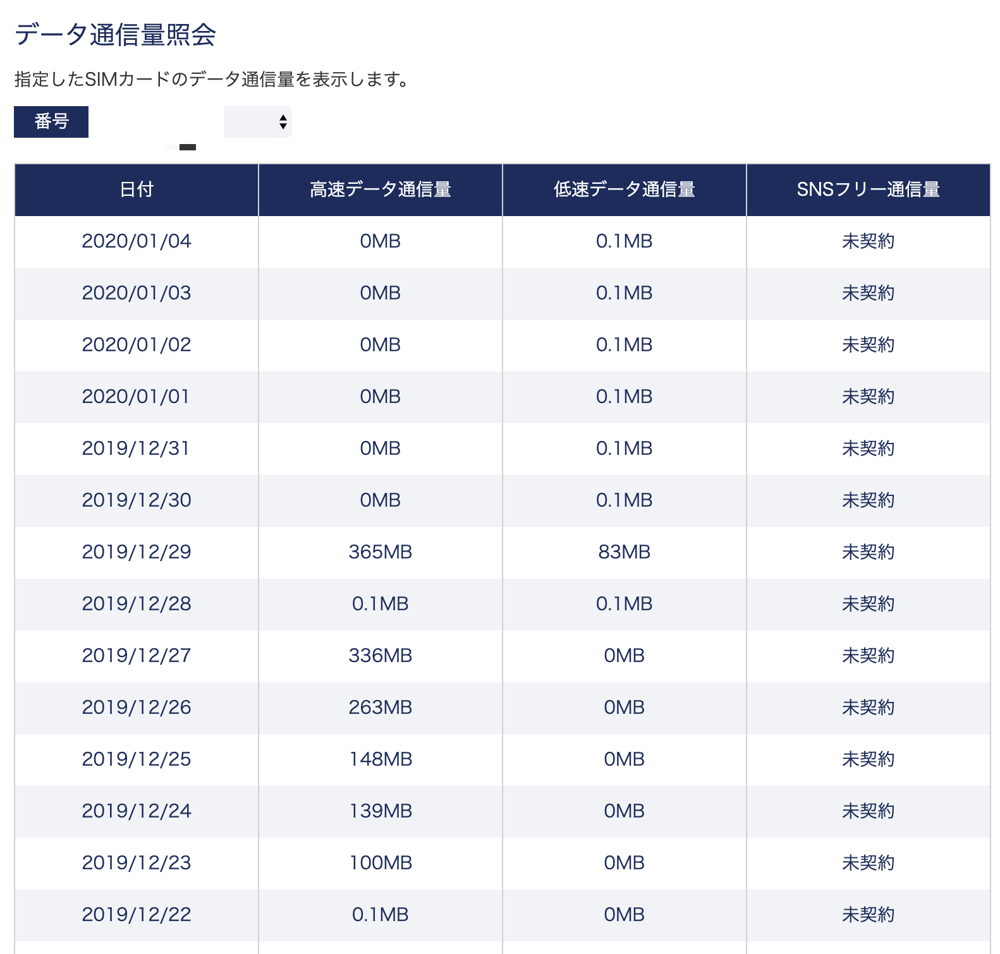
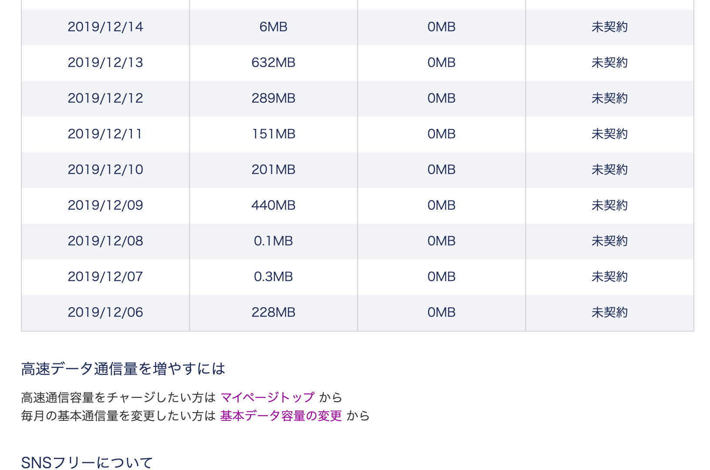
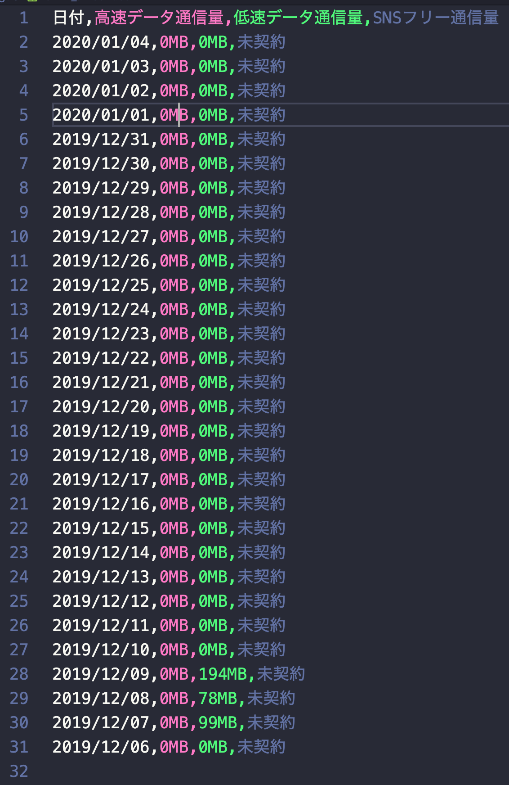

[](https://circleci.com/gh/corselia/amount-of-your-dmm-mobile-traffic) 

# DMMモバイルのマイページ内の「データ通信量照会」のデータを取得する





# 出力されるCSV
- [__tests__/dmm_mobile_data_traffic_result.csv](__tests__/dmm_mobile_data_traffic_result.csv)



## HTML の構造
- サンプルファイル（テスト時にも使用）を用意した。
  - [__tests__/dmm_mobile_data_traffic_info_sample.html](__tests__/dmm_mobile_data_traffic_info_sample.html)

### 電話番号 の部分
- 1つ目の電話番号
  - `#fn-number > option:nth-child(1)`
- 2つ目の電話番号
  - `#fn-number > option:nth-child(2)`
- 3つ目の電話番号
  - `#fn-number > option:nth-child(3)`

### 料金表 の部分

#### thead の部分
- 日付
  - `body > section > div > section.area-right > section.box-recentCharge > div > table > thead > tr > th:nth-child(1)`
- 高速データ通信量
  - `body > section > div > section.area-right > section.box-recentCharge > div > table > thead > tr > th:nth-child(2)`
- 低速データ通信量
  - `body > section > div > section.area-right > section.box-recentCharge > div > table > thead > tr > th:nth-child(3)`
- SNSフリー通信量
  - `body > section > div > section.area-right > section.box-recentCharge > div > table > thead > tr > th:nth-child(4)`

#### tbody の部分

##### 1行目（最初の行） の部分
- `body > section > div > section.area-right > section.box-recentCharge > div > table > tbody > tr:nth-child(1) > td:nth-child(1)`
- `body > section > div > section.area-right > section.box-recentCharge > div > table > tbody > tr:nth-child(1) > td:nth-child(2)`
- `body > section > div > section.area-right > section.box-recentCharge > div > table > tbody > tr:nth-child(1) > td:nth-child(3)`
- `body > section > div > section.area-right > section.box-recentCharge > div > table > tbody > tr:nth-child(1) > td:nth-child(4)`

##### 30行目（最後の行） の部分
- `body > section > div > section.area-right > section.box-recentCharge > div > table > tbody > tr:nth-child(30) > td:nth-child(1)`
- `body > section > div > section.area-right > section.box-recentCharge > div > table > tbody > tr:nth-child(30) > td:nth-child(2)`
- `body > section > div > section.area-right > section.box-recentCharge > div > table > tbody > tr:nth-child(30) > td:nth-child(3)`
- `body > section > div > section.area-right > section.box-recentCharge > div > table > tbody > tr:nth-child(30) > td:nth-child(4)`

# (WIP) 開発方法

```bash
$ yarn build
$ node public/bundle.js
```

# (WIP) 開発中のパッケージをローカルにインストールする方法

```bash
$ npm link
```
