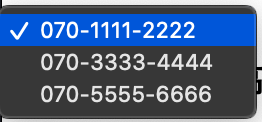

[](https://nodei.co/npm/amount-dmm-mobile/)

[](https://circleci.com/gh/nikukyugamer/amount-of-your-dmm-mobile-traffic) 

# DMMモバイルのマイページ内の「データ通信量照会」のデータを取得する

## 実行方法

#### インストール

```bash
$ npm install amount-dmm-mobile
```

または

```bash
$ yarn add amount-dmm-mobile
```

#### 準備
コマンドを実行するディレクトリに `.env` ファイルを作り、そのファイルの中に DMM の ID（メールアドレス）とパスワードを以下のように設定して下さい。

```
DMM_USERNAME=foobar@example.com
DMM_PASSWORD=your_password
```

#### 使い方
以下のコマンドを実行すると、実行したディレクトリに `amount_of_dmm_mobile.csv` という料金データが記録された CSV ファイル が生成されます。

```bash
$ npx amount_dmm_mobile
```

##### 実行時オプション
~~実行時オプションとして、`--number 2` のようにすると、2つ目の契約の番号のデータが得られます。デフォルトでは `--number 1` です。~~

セレクタの変更に伴い、以下の `--number` オプションはいったん無効となっています。

```bash
$ amount_dmm_mobile --number 2
```



#### ヘルプの内容
```bash
$ amount_dmm_mobile --help
Usage: amount_dmm_mobile [options]

Options:
  -n, --number <number>  A Nth number which indicates the Nth telephone number
                         in "My Page" (default: "1")
  -h, --help             output usage information
```

## 概要
- 実行時間は、約90秒です
- あまりに短い間隔で実行すると、BAN的なことをされる可能性があるかもしれません


## 出力されるCSV
- [__tests__/dmm_mobile_data_traffic_result.csv](__tests__/dmm_mobile_data_traffic_result.csv)


# 開発方法
- コードを書く
- `$ npm link` を実行してインストールする
- `$ npx amount_dmm_mobile` を実行して動作を確かめる
- 不要になったら `$ npm unlink` で削除する

# エラーメッセージとその対応策
- `UnhandledPromiseRejectionWarning: TypeError: text is not iterable at Keyboard.type`
  - ユーザ名とパスワード（環境変数）は設定されていますか？

# LICENSE
- [MIT LICENSE](/LICENSE)
